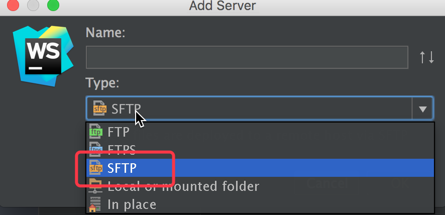
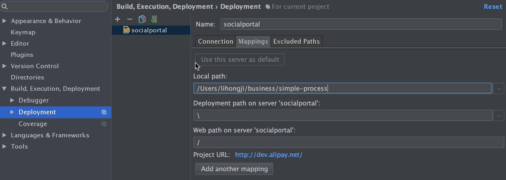
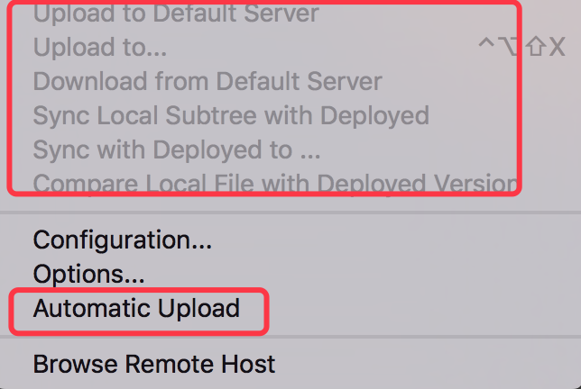

### webstorm把本地文件上传到服务器
**Preferences-Settings-Build,Execution,Deployment-Deployment**

* 新建server

`name`建议跟服务器名称相同，`type`选择`sftp`。

* 配置服务器信息

`upload/download project files`配置服务器信息。`browse files on server` 配置服务器web root地址。

* 配置本地信息

`local path`配置本地文件路径。

`deployment path`配置服务器相对路径，也就是相对于`connection`中`root path`路径。

`web path`配置服务器url相对路径，也就是相对于`connection`中`browse files on server`中的路径。

*note: 如果我们有多组映射，可以`add another mapping`，会生成一个映射列表。*

* 上传/下载

**tools-deployment-upload/download**

*note: 如果想自动上传，可以勾选自动上传按钮*