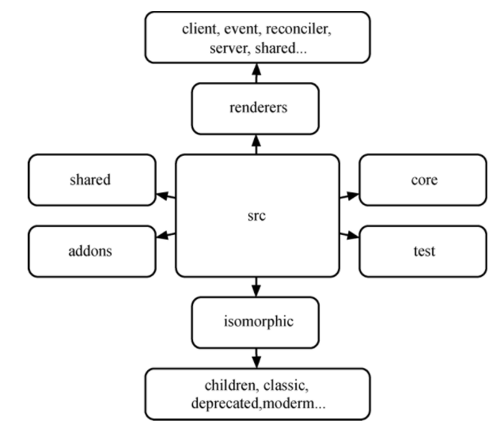
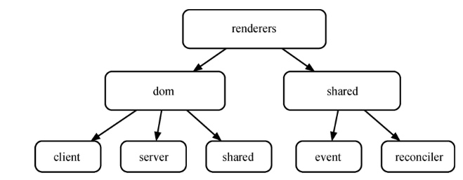

#### react工程分析

**react版本15.0.0**

在 React 源码中，每个文件的命名风格属于字面与含义可相互解释，整体的代码结构按照 `addons、isomorphic、renderers、shared、core、test` 进行组织。

* addons：包含一系列的工具方法插件，如 `PureRenderMixin、CSSTransitionGroup、Fragment、LinkedStateMixin` 等。

* isomorphic：包含一系列同构方法。

* shared：包含一些公用或常用方法，如 ``Transaction、CallbackQueue` 等。

* test：包含一些测试方法等。

* tests：包含一些边界错误的测试用例。

* **renderers**：是 React代码的核心部分，它包含了大部分功能实现，此处对其进行单独分析。
renderers 分为 dom 和 shared 目录。
    * dom：包含 client、server 和 shared。

        * client：包含 DOM 操作方法（如 `findDOMNode、setInnerHTML、setTextContent` 等）以及事件方法。这里的事件方法主要是一些非底层的实用性事件方法，如事件监听（`ReactEventListener`）、常用事件方法（`TapEventPlugin、EnterLeaveEventPlugin`）以及一些合成事件（`SyntheticEvents` 等）。

        

        * server：主要包含服务端渲染的实现和方法（如 `ReactServerRendering、ReactServerRenderingTransaction` 等）。

        * shared：包含文本组件（`ReactDOMTextComponent`）、标签组件（`ReactDOMComponent`）、DOM 属性操作（`DOMProperty、DOMPropertyOperations`）、CSS 属性操作（`CSSProperty、CSSPropertyOperations`）等。

    * shared：包含 event 和 reconciler。

        * event：包含一些更为底层的事件方法，如事件插件中心（EventPluginHub）、事件注册（EventPluginRegistry）、事件传播（EventPropagators）以及一些事件通用方法。
        React 自定义了一套通用事件的插件系统，该系统包含事件监听器、事件发射器、事件插件中心、点击事件、进/出事件、简单事件、合成事件以及一些事件方法，如图 3-3 所示。
        

        * reconciler：称为协调器，它是最为核心的部分，包含 React 中自定义组件的实现（ReactCompositeComponent）、组件生命周期机制、setState 机制（ReactUpdates、ReactUpdateQueue）、DOM diff 算法（ReactMultiChild）等重要的特性方法。

那么，为何说 reconciler 是 React 最为核心的部分呢？

在 Web 开发中，要将更新的数据实时反应到 UI 上，就不可避免地需要对 DOM 进行操作，而复杂频繁的 DOM 操作通常是产生性能瓶颈的原因之一。为此，React 引入了 Virtual DOM 机制。毫不夸张地说，Virtual DOM 是 React 的核心与精髓所在，而 reconciler 就是实现 Virtual DOM 的主要源码。

Virtual DOM 实际上是在浏览器端用 JavaScript 实现的一套 DOM API，它之于 React 就好似一个虚拟空间，包括一整套 Virtual DOM 模型、生命周期的维护和管理、性能高效的 diff 算法和将 Virtual DOM 展示为原生 DOM 的 Patch 方法等。

基于 React 进行开发时，所有的 DOM 树都是通过 Virtual DOM 构造的。React 在 Virtual DOM 上实现了 DOM diff 算法，当数据更新时，会通过 diff 寻找到需要变更的 DOM 节点，并只对变化的部分进行实际的浏览器的 DOM 更新，而不是重新渲染整个 DOM 树。

**React 也能够实现 Virtual DOM 的批处理更新，当操作 Virtual DOM 时，不会马上生成真实的 DOM，而是会将一个事件循环（event loop）内的两次数据更新进行合并，这样就使得 React 能够在事件循环的结束之前完全不用操作真实的 DOM。例如，多次进行节点内容 A→B，B→A 的变化，React 会将多次数据更新合并为 A→B→A，即 A→A，认为数据并没有更新，因此 UI 也不会发生任何变化。如果通过手动控制，这种逻辑通常是极其复杂的。**

尽管每一次都需要构造完整的 Virtual DOM 树，但由于 Virtual DOM 是 JavaScript 对象，性能极高，而对原生 DOM 进行操作的仅仅是 diff 部分，因而能达到提高性能的目的。这样，在保证性能的同时，开发者将不再需要关注某个数据的变化如何更新到具体的 DOM 元素，而只需要关心在任意数据状态下，整个界面是如何渲染的。