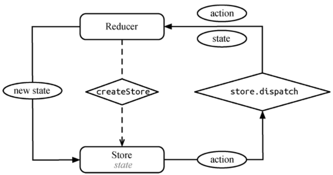

周末两天时间，把redux（3.6.0）和react-redux（4.4.5）源码注释了一遍。注释文件分别在[redux-doc][1]与[react-redux-doc][2]中。

redux源码很简单，react-redux有些复杂，但只要花点心思仔细阅读，你会发现，还是那么难懂。

废话不多说，这篇文章详解redux源码。看源码之前一定要熟读KPI，不用倒背如流但一定要清楚不同传参形式与柯里化调用（其实看源码之前看一遍API就行了）。

## 核心概念

redux的核心思想来自于flux，可以说flux是规范，而state是实现。flux 的提出主要是针对现有前端 MVC 框架的局限总结出来的一套基于 dispatcher 的前端应用架构模式。如果用 MVC 的命名习惯，它应该叫 ADSV（Action Dispatcher Store View）。正如其名，Flux 的核心思想就是数据和逻辑永远单向流动。

redux 参考了 flux 的设计，但是对 flux 许多冗余的部分（如 dispatcher）做了简化，同时将函数式编程的思想融合其中。


* state: 通过store.getState函数返回，当前store的数据状态。
* store: 通过createStore函数创建,又包含了下面4个核心方法。
    * getState()：获取 store 中当前的状态。
    * dispatch(action)：分发一个 action，并返回这个action，这是唯一能改变 store 中数据的方式。
    * subscribe(listener)：注册一个监听者，它在 store 发生变化时被调用。
    * replaceReducer(nextReducer)：更新当前 store 里的 reducer，一般只会在开发模式中调用该方法。
* reducer: reducer是一个处理函数，用来处理每个动作的函数集合。
* action: action 是一个普通的 JavaScript 对象，一般包含 type、payload 等字段，用于描述一个事件以及需要改变的相关数据。
* middleware: 它提供了一个分类处理 action 的机会。在 middleware 中，你可以检阅每一个流过的 action，挑选出特定类型的 action 进行相应操作，给你一次改变 action 的机会。

## createStore
createStore函数用来创建store，而store是redux的核心，几乎redux所有概念都跟store有关。

首先我们看看createStore的函数签名：
```
function createStore(reducer, preloadedState, enhancer) {
  // ...
}
```

我们在使用createStore时候，通常只传递reducer，剩下的两个参数是3.1.0以后才加入的。preloadedState是初始化state值。enhancer是上文提到的middleware，这个思想来自于koa-middleware。

我们看看接下来是如何工作的
```
  // 如果初始化传入的是函数并且没有传入中间件，则初始化函数设为中间件
  if (typeof preloadedState === 'function' && typeof enhancer === 'undefined') {
    enhancer = preloadedState;
    preloadedState = undefined;
  }
```

这种接口设计模式类似于jquery，即不定向函数签名。

接下来声明了一些列变量
```
  // currentState: 当前数据
  var currentReducer = reducer                      // 当前reducer
  var currentState = preloadedState                 // 初始化状态
  var currentListeners = []                         // 当前订阅的事件
  var nextListeners = currentListeners              // 下次订阅的事件
  var isDispatching = false                         // 是否正在分配事件
```
这里为什么要区分当前订阅事件与下次订阅事件呢？后面我们会给出答案

```
  /* 获得当前store的所有数据 */
  function getState() {
    return currentState
  }

  /* 订阅函数 */
  function subscribe(listener) {
    if (typeof listener !== 'function') {
      throw new Error('Expected listener to be a function.')
    }

    var isSubscribed = true

    ensureCanMutateNextListeners()
    // 更新下次订阅函数，每次发布时候，执行订阅函数
    nextListeners.push(listener)

    return function unsubscribe() {
      if (!isSubscribed) {
        return
      }

      isSubscribed = false

      ensureCanMutateNextListeners()
      var index = nextListeners.indexOf(listener)
      nextListeners.splice(index, 1)
    }
  }
```
getState没什么好说的。订阅函数也很清楚明了，订阅一系列要执行的方法，返回一个函数，再次执行取消订阅。这与原生js的设计完全不同。原生js的removeEventListener需要指定原绑定函数。

ensureCanMutateNextListeners函数会把当前订阅的函数拷贝给下次订阅的函数，为什么这么做，带上刚才的问题，一会再讲（现在真的没法讲，讲了你也听不懂。）

下面是store中最重要的的函数dispatch，整个redux的数据变化都是靠它完成，包括一部分界面render，我们看下dispatch的源码
```
  /* 发布函数 */
  function dispatch(action) {
    if (!isPlainObject(action)) {
      throw new Error(
        'Actions must be plain objects. ' +
        'Use custom middleware for async actions.'
      )
    }

    if (typeof action.type === 'undefined') {
      throw new Error(
        'Actions may not have an undefined "type" property. ' +
        'Have you misspelled a constant?'
      )
    }

    if (isDispatching) {
      throw new Error('Reducers may not dispatch actions.')
    }

    // 执行当前reducer,当前reducer可以被replace掉
    try {
      // 执行的过程中，记录状态，如果执行的过程中再执行，会报错
      isDispatching = true
      currentState = currentReducer(currentState, action)
    } finally {
      isDispatching = false
    }

    // 每次发布时候，更新当前订阅函数。发布的时候再订阅，会把下次订阅的函数从当前函数拷贝一份，防止当前执行发布函数受影响
    var listeners = currentListeners = nextListeners

    // 依次执行每个订阅函数
    for (var i = 0; i < listeners.length; i++) {
      var listener = listeners[i]
      listener()
    }

    return action
  }
```
我们可以清晰的看到这里把当前的状态和action传递给reducer，并且把返回结果重新赋值给currentState。用isDispatching来控制执行发布中不能再次发布。

这里解释一下刚才的疑问，为什么每次订阅时候都放在nextListeners中。

**发布的过程中，会依次执行所有订阅函数，如果发布的过程中再次订阅，那么当前发布时所执行的订阅数组也会有影响。**

**redux如何解决这个问题呢？所以每次发布过程中，拿到的是订阅的一个副本（currentListeners=nextListeners），而再次订阅（或者取消订阅）时，会拿这个副本拷贝给订阅的函数（ nextListeners = currentListeners.slice()。也就是之前说过的ensureCanMutateNextListeners函数。）**

接下来替换掉reducer函数。源码清晰可见，不做过多解释。
```
  // 替换掉当前 reducer
  function replaceReducer(nextReducer) {
    if (typeof nextReducer !== 'function') {
      throw new Error('Expected the nextReducer to be a function.')
    }

    currentReducer = nextReducer
    // 替换后，重新执行init函数
    dispatch({ type: ActionTypes.INIT })
  }
```
最后是 observable 函数，配合其他库使用。
```
  function observable() {
    // subscribe 就是上面的那个 subscribe订阅函数
    var outerSubscribe = subscribe
    return {
      subscribe(observer) {
        if (typeof observer !== 'object') {
          throw new TypeError('Expected the observer to be an object.')
        }

        function observeState() {
          // 调用 observer 的 next 方法，获取当前 state。
          if (observer.next) {
            observer.next(getState())
          }
        }

        observeState()
        // 将 observeState 当作一个 listener，dispatch 之后自动调用 observer 的 next 方法。
        var unsubscribe = outerSubscribe(observeState)
        return { unsubscribe }
      },

      [$$observable]() {
        return this
      }
    }
  }
```
observable 是为了配合 Rxjs 这样 observable/reactive 库，不久的将来 EMCAScript 可能会支持原生的 observable/reactive 对象。[tc39/proposal-observable][3]

最后执行一下初始化
```
dispatch({ type: ActionTypes.INIT })
```

## bindActionCreateors
这个函数可以把dispatch(action)动作直接作为属性传递给react组件，而不用在组件内部再次dispatch(action),这么做的好处是做到react与redux完全分离，组件内部无感知redux的存在。

拿todo list举例：
```
// actions.js
function addTodo(text) {
  return {
    type: 'ADD_TODO',
    text
  }
}

function removeTodo(id) {
  return {
    type: 'REMOVE_TODO',
    id
  }
}

const actions = { addTodo, removeTodo }

// App.js
class App extends Component {
  render() {
    const { visibleTodos, visibilityFilter, actions } = this.props
    return (
      <div>
        <AddTodo
          onAddClick={text =>
            actions.addTodo(text)
          }/>
        <TodoList
          todos={visibleTodos}
          onTodoClick={index =>
            actions.completeTodo(index)
          }/>
        <Footer
          filter={visibilityFilter}
          onFilterChange={nextFilter =>
            actions.setVisibilityFilter(nextFilter)
          }/>
      </div>
    )
  }
}

function mapDispatchToProps(dispatch, a) {
  return { actions: bindActionCreators(actions, dispatch) }
}

const FinalApp = connect(select, mapDispatchToProps)(App)

ReactDOM.render(
  <Provider store={createStore(reducer)}>
    <FinalApp />
  </Provider>,
  document.getElementById('app')
)
```
这样就可以把dispatch包装后的actions直接传递给app，而app内部无需再diapatch(action)

源码实现也非常简单
```
function bindActionCreator(actionCreator, dispatch) {
  // 包装一层dispatch，返回高阶函数，因为原来的actionCreator是可以传递参数的函数，包装后不能破坏原结构
  return (...args) => dispatch(actionCreator(...args))
}

export default function bindActionCreators(actionCreators, dispatch) {
  // 拿到 actionName: addTodo removeTodo
  var keys = Object.keys(actionCreators)
  var boundActionCreators = {}
  for (var i = 0; i < keys.length; i++) {
    // 第一次执行key = addTodo(string)
    var key = keys[i]
    // actionCreator = addTodo(function)
    var actionCreator = actionCreators[key]
    if (typeof actionCreator === 'function') {
      // 包装函数：在原函数上增加dispatch包装。
      // 我们直接把经过dispatch包装过函数传递给子组件，而不是让子组件拿到传递过去dispatch再去执行，这样子组件只通过传递过去的函数调用即可，完全不知道有redux的存在
      boundActionCreators[key] = bindActionCreator(actionCreator, dispatch)
    }
  }
  return boundActionCreators
}
```

### combineReducers
这个函数有两个用途

* 把多个reducers合并成一个，既做到reducer解构
* 按照解构的名称，把不同的数据分发到不同的state键下。

举例来说，我们有两个reducer，现在要合成一个。
```
function r1(state, action) {}
function r2(state, action) {}

const reducer = combineReducers({
  r1,
  r2
})
```
这样store就有两个键：r1和r2，分别存储每个reducer的返回结果。
也就是说，使用combineReducers把全局store按命名空间进行隔离。隔离的方式就是reducer的名字： { r1: state, r2: state }。

combineReducers实现有些繁琐，不过也不难。
```
function combineReducers(reducers) {
  var reducerKeys = Object.keys(reducers)
  // 内部创建保存reducers的变量
  var finalReducers = {}

  // 保存reducer到finalReducers中，也做了数据过滤
  for (var i = 0; i < reducerKeys.length; i++) {
    var key = reducerKeys[i]

    if (NODE_ENV !== 'production') {
      if (typeof reducers[key] === 'undefined') {
        warning(`No reducer provided for key "${key}"`)
      }
    }

    if (typeof reducers[key] === 'function') {
      finalReducers[key] = reducers[key]
    }
  }
  // 获得所有key, 也就是[ 'r1', 'r2' ]
  var finalReducerKeys = Object.keys(finalReducers)

  if (NODE_ENV !== 'production') {
    var unexpectedKeyCache = {}
  }

  // 检验每个reducer是否有返回值
  var sanityError
  try {
    assertReducerSanity(finalReducers)
  } catch (e) {
    sanityError = e
  }

  return function combination(state = {}, action) {
    if (sanityError) {
      throw sanityError
    }

    if (NODE_ENV !== 'production') {
      var warningMessage = getUnexpectedStateShapeWarningMessage(state, finalReducers, action, unexpectedKeyCache)
      if (warningMessage) {
        warning(warningMessage)
      }
    }

    var hasChanged = false
    var nextState = {}
    for (var i = 0; i < finalReducerKeys.length; i++) {
      // 每个reducer的key, r1
      var key = finalReducerKeys[i]
      // 每个reducer的值, r1函数
      var reducer = finalReducers[key]
      // key的上一次状态，也就是state['r1']
      var previousStateForKey = state[key]
      // 执行每个reducer，把上一次的状态和action传入，返回一个新的状态
      var nextStateForKey = reducer(previousStateForKey, action)
      if (typeof nextStateForKey === 'undefined') {
        var errorMessage = getUndefinedStateErrorMessage(key, action)
        throw new Error(errorMessage)
      }
      // 下次的状态更新
      nextState[key] = nextStateForKey
      // 判断是否变化
      hasChanged = hasChanged || nextStateForKey !== previousStateForKey
    }
    // 如果有变化，返回变化后的状态
    return hasChanged ? nextState : state
  }
}
```
看注释并不难理解，在dispatch时候，依次执行每个reducer，因为每个reducer都可以对action.type做处理。取得上次的状态值，执行reducer并且更新数据。

以上就是对redux所有源代码进行的分析，下一篇文章会针对react-redux做代码解析。

  [1]: https://github.com/antgod/redux-doc/tree/master/src
  [2]: https://github.com/antgod/react-redux-doc/tree/master/src
  [3]: https://github.com/zenparsing/es-observable